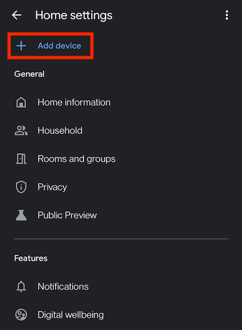
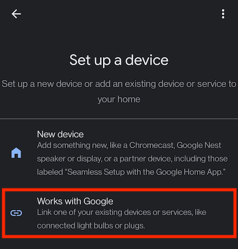
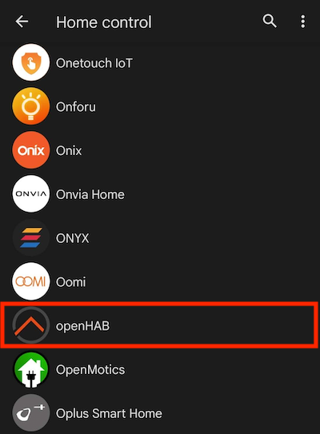

# Google Assistant Action

Google Assistant is Google’s virtual personal assistant and uses Actions on Google as the platform for "Actions" (software applications) to extend the functionality of the Google Assistant. Users engage Google Assistant in conversation to get things done, like controlling their devices and things at home. You can use the officially certified openHAB Action for Google Assistant to easily manage and control your smart home by conversational experiences between you and your openHAB smart home powered by voiced commands.

This guide describes step by step how to use the [openHAB Google Assistant Smart Home Action](https://assistant.google.com/services/a/uid/000000f5c61c627e?hl=en-US&source=web). The openHAB Action links your openHAB setup through the [myopenHAB.org](https://www.myopenhab.org) cloud service to the Google Assistant platform (for technical insights, please refer to this [guide](https://github.com/openhab/openhab-google-assistant/blob/master/README.md) to read more about setup options and development information).

With the Action you can voice control your openHAB items and it supports lights, plugs, switches, thermostats and many more. The openHAB Action comes with multiple language support like English, German or French language.

## General Configuration Instructions

::: tip
This integration relies on the cloud connector addon.
More information can be found in the corresponding [docs page](https://www.openhab.org/link/openhabcloud).
:::

### Requirements

* The openHAB Cloud Connector configured using myopenHAB.org (Items DO NOT need to be exposed to and will not show up on myopenHAB.org, this is only required for the IFTTT service!)
* A Google account
* A Google Home/Nest Voice Assistant Device or the Google Assistant on your phone

### Item configuration

To expose [items](https://www.openhab.org/docs/concepts/items.html) to Google Assistent you will need to add [metadata](https://www.openhab.org/docs/concepts/items.html#item-metadata) in the `ga` namespace.

Currently the following devices are supported (also depending on Google's API capabilities):

_Hint: The value of `ga` is **not** case-sensitive._

#### `Switch`

| | |
|---|---|
| **Device Type** | [Switch](https://developers.google.com/assistant/smarthome/guides/switch) |
| **Supported Traits** | [OnOff](https://developers.google.com/assistant/smarthome/traits/onoff) |
| **Supported Items** | Switch |
| **Configuration** | (optional) `inverted (boolean)` |

**Example:**

```shell
Switch { ga="Switch" [ inverted=false ] }
```

#### `Light`

| | |
|---|---|
| **Device Type** | [Light](https://developers.google.com/assistant/smarthome/guides/light) |
| **Supported Traits** | [OnOff](https://developers.google.com/assistant/smarthome/traits/onoff), [ColorSetting](https://developers.google.com/assistant/smarthome/traits/colorsetting), [Brightness](https://developers.google.com/assistant/smarthome/traits/brightness) (depending on used item type) |
| **Supported Items** | Switch, Dimmer, Color |
| **Configuration** | (optional) `inverted=true/false`<br>(optional) `colorTemperatureRange=minK,maxK` |

```shell
Color { ga="Light" [ inverted=false, colorTemperatureRange="2000,9000" ] }
```

#### `Light as Group with separate Color and Brightness`

| | |
|---|---|
| **Device Type** | [Light](https://developers.google.com/assistant/smarthome/guides/light) |
| **Supported Traits** | [OnOff](https://developers.google.com/assistant/smarthome/traits/onoff), [ColorSetting](https://developers.google.com/assistant/smarthome/traits/colorsetting), [Brightness](https://developers.google.com/assistant/smarthome/traits/brightness) |
| **Supported Items** | Group as `light` with two Number or Dimmer members as `lightBrightness` & `lightColorTemperature` |
| **Configuration** | (optional) `useKelvin=true/false`<br>(optional) `colorTemperatureRange=minK,maxK`<br>_Hint: if you do not set `useKelvin=true` then `colorTemperatureRange` is required_ |

```shell
Group groupItem { ga="Light" [ useKelvin=true, colorTemperatureRange="2000,9000" ] }
Dimmer brightnessItem (groupItem) { ga="lightBrightness" }
Dimmer colorItem (groupItem) { ga="lightColorTemperature" }
```

#### `Scene`

| | |
|---|---|
| **Device Type** | [Scene](https://developers.google.com/assistant/smarthome/guides/scene) |
| **Supported Traits** | [Scene](https://developers.google.com/assistant/smarthome/traits/scene) |
| **Supported Items** | Switch |
| **Configuration** | (optional) `sceneReversible=true/false` |

```shell
Switch { ga="Scene" [ sceneReversible=false ] }
```

#### `Outlet`, `Coffee_Maker`, `WaterHeater`, `Fireplace`

| | |
|---|---|
| **Device Type** | [Outlet](https://developers.google.com/assistant/smarthome/guides/outlet), [Coffee_Maker](https://developers.google.com/assistant/smarthome/guides/coffeemaker), [WaterHeater](https://developers.google.com/assistant/smarthome/guides/outlet), [Fireplace](https://developers.google.com/assistant/smarthome/guides/fireplace) |
| **Supported Traits** | [OnOff](https://developers.google.com/assistant/smarthome/traits/onoff) |
| **Supported Items** | Switch |
| **Configuration** | (optional) `inverted=true/false` |

```shell
Switch { ga="Outlet" [ inverted=true ] }
Switch { ga="Coffee_Maker" [ inverted=true ] }
Switch { ga="WaterHeater" [ inverted=true ] }
Switch { ga="Fireplace" [ inverted=true ] }
```

#### `Valve`

| | |
|---|---|
| **Device Type** | [Valve](https://developers.google.com/assistant/smarthome/guides/valve) |
| **Supported Traits** | [OpenClose](https://developers.google.com/assistant/smarthome/traits/openclose) |
| **Supported Items** | Switch |
| **Configuration** | (optional) `inverted=true/false` |

```shell
Switch { ga="Valve" [ inverted=true ] }
```

#### `Sprinkler`, `Vacuum`

| | |
|---|---|
| **Device Type** | [Sprinkler](https://developers.google.com/assistant/smarthome/guides/sprinkler), [Vacuum](https://developers.google.com/assistant/smarthome/guides/vacuum) |
| **Supported Traits** | [StartStop](https://developers.google.com/assistant/smarthome/traits/startstop) |
| **Supported Items** | Switch |
| **Configuration** | (optional) `inverted=true/false` |

```shell
Switch { ga="Sprinkler" [ inverted=true ] }
Switch { ga="Vacuum" [ inverted=true ] }
```

#### `Lock`

| | |
|---|---|
| **Device Type** | [Lock](https://developers.google.com/assistant/smarthome/guides/lock) |
| **Supported Traits** | [LockUnlock](https://developers.google.com/assistant/smarthome/traits/lockunlock) |
| **Supported Items** | Contact (no device control), Switch |
| **Configuration** | (optional) `ackNeeded=true/false`<br>(optional) `pinNeeded="1234"` |

```shell
Switch { ga="Lock" [ ackNeeded=true ] }
Switch { ga="Lock" [ pinNeeded="1234" ] }
```

#### `SecuritySystem`

| | |
|---|---|
| **Device Type** | [SecuritySystem](https://developers.google.com/assistant/smarthome/guides/securitysystem) |
| **Supported Traits** | [ArmDisarm](https://developers.google.com/assistant/smarthome/traits/armdisarm) |
| **Supported Items** | Switch |
| **Configuration** | (optional) `ackNeeded=true/false`<br>(optional) `pinNeeded="1234"` |

```shell
Switch { ga="SecuritySystem" [ pinNeeded="1234" ] }
```

#### `Camera`

| | |
|---|---|
| **Device Type** | [Camera](https://developers.google.com/assistant/smarthome/guides/camera) |
| **Supported Traits** | [CameraStream](https://developers.google.com/assistant/smarthome/traits/camerastream) |
| **Supported Items** | String |
| **Configuration** | (optional) `protocols="hls,dash,smooth_stream,progressive_mp4"` _(choose suitable)_ |

```shell
String { ga="Camera" [ protocols="hls,dash" ] }
```

#### `Speaker` (volume control only)

| | |
|---|---|
| **Device Type** | [Speaker](https://developers.google.com/assistant/smarthome/guides/speaker) |
| **Supported Traits** | [Volume](https://developers.google.com/assistant/smarthome/traits/volume) |
| **Supported Items** | Dimmer |
| **Configuration** | (optional) `volumeDefaultPercentage="20"`<br>(optional) `levelStepSize="5"`<br>(optional) `volumeMaxLevel="100"` |

```shell
Dimmer { ga="Speaker" [ volumeDefaultPercentage="50", levelStepSize="10", volumeMaxLevel="90" ] }
```

#### `TV`

| | |
|---|---|
| **Device Type** | [TV](https://developers.google.com/assistant/smarthome/guides/tv) |
| **Supported Traits** | [OnOff](https://developers.google.com/assistant/smarthome/traits/onoff), [Volume](https://developers.google.com/assistant/smarthome/traits/volume), [TransportControl](https://developers.google.com/assistant/smarthome/traits/transportcontrol), [InputSelector](https://developers.google.com/assistant/smarthome/traits/inputselector), [Channel](https://developers.google.com/assistant/smarthome/traits/channel) (depending on used members) |
| **Supported Items** | Group as `TV` with the following optional members: Switch as `tvPower`, Switch as `tvMute`, Dimmer as `tvVolume`, String as `tvChannel`, String as `tvInput`, Player as `tvTransport` |
| **Configuration** | (optional) `volumeDefaultPercentage="20"`<br>(optional) `levelStepSize="5"`<br>(optional) `volumeMaxLevel="100"`<br>(optional) `transportControlSupportedCommands="NEXT,PREVIOUS,PAUSE,RESUME"`<br>(optional) `availableInputs="hdmi1=xbox,hdmi2=settopbox"`<br>(optional) `availableChannels="1=Channel1=NBC,2=Channel2=CBS"` |


```shell
Group tvGroup { ga="TV" [ volumeDefaultPercentage="20", levelStepSize="10", volumeMaxLevel="100", transportControlSupportedCommands="NEXT,PREVIOUS,PAUSE,RESUME", availableInputs="hdmi1=xbox,hdmi2=settopbox", availableChannels="1=Channel1=NBC,2=Channel2=CBS" ] }
Switch powerItem (tvGroup) { ga="tvPower" }
Switch muteItem (tvGroup) { ga="tvMute" }
Dimmer volumeItem (tvGroup) { ga="tvVolume" }
String channelItem (tvGroup) { ga="tvChannel" }
String inputItem (tvGroup) { ga="tvInput" }
Player transportItem (tvGroup) { ga="tvTransport" }
```

#### `Fan`, `Hood`, `AirPurifier`

| | |
|---|---|
| **Device Type** | [Fan](https://developers.google.com/assistant/smarthome/guides/fan), [Hood](https://developers.google.com/assistant/smarthome/guides/hood), [AirPurifier](https://developers.google.com/assistant/smarthome/guides/airpurifier) |
| **Supported Traits** | [OnOff](https://developers.google.com/assistant/smarthome/traits/OnOff), [FanSpeed](https://developers.google.com/assistant/smarthome/traits/fanspeed) (depending on used item type) |
| **Supported Items** | Switch (no speed control), Dimmer |
| **Configuration** | (optional) `speeds="0=away:zero,50=default:standard:one,100=high:two"`<br>(optional) `lang="en"`<br>(optional) `ordered=true/false`<br>_Hint: if you are using a Dimmer then `speeds` is required_ |

Fans (and similar device types, like AirPurifier or Hood) support the `FanSpeed` trait.
With that you will be able to set up and use human speakable modes, e.g. "fast" for 100% or "slow" for 25%.

`speeds` will be a comma-separated list of modes with a percentage number followed by an equal sign and different aliases for that mode after a colon.
So here both "high" and "two" would set the speed to 100%.
You are also able to define the language of those aliases.
The option `ordered` will tell the system that your list is ordered and you will then be able to also say "faster" or "slower" and Google will use the next or previous speed.

```shell
Dimmer { ga="Fan" [ speeds="0=away:zero,50=default:standard:one,100=high:two", lang="en", ordered=true ] }
Switch { ga="Hood" }
Dimmer { ga="AirPurifier" [ speeds="0=off,50=mid,100=high" ] }
```

#### `Awning`, `Blinds`, `Curtain`, `Door`, `Garage`, `Gate`, `Pergola`, `Shutter`, `Window`

| | |
|---|---|
| **Device Type** | [Awning](https://developers.google.com/assistant/smarthome/guides/awning), [Blinds](https://developers.google.com/assistant/smarthome/guides/Blinds), [Curtain](https://developers.google.com/assistant/smarthome/guides/Curtain), [Door](https://developers.google.com/assistant/smarthome/guides/Door), [Garage](https://developers.google.com/assistant/smarthome/guides/Garage), [Gate](https://developers.google.com/assistant/smarthome/guides/Gate), [Pergola](https://developers.google.com/assistant/smarthome/guides/Pergola), [Shutter](https://developers.google.com/assistant/smarthome/guides/Shutter), [Window](https://developers.google.com/assistant/smarthome/guides/Window) |
| **Supported Traits** | [OpenClose](https://developers.google.com/assistant/smarthome/traits/openclose), [StartStop](https://developers.google.com/assistant/smarthome/traits/startstop) |
| **Supported Items** | Contact (no device control), Switch (no open percentage), Rollershutter |
| **Configuration** | (optional) `inverted=true/false` |

Blinds and simiar devices should always use the `Rollershutter` item type for proper functionallity.
Since Google and openHAB use the oposite percentage value for "opened" and "closed", the action will tranlate this automatically.
If the values are still inverted in your case, you can state the `inverted=true` option for all `Rollershutter` items.

Since Google only tells the open percentage (and not the verb "close" or "down"), it can not be differentiated between saying "set blind to 100%" or "open blind".
Therefore, it is not possible to "not invert" the verbs, if the user chooses to invert the numbers.

```shell
Rollershutter { ga="Awning" }
Rollershutter { ga="Blinds" [ inverted=true ] }
Rollershutter { ga="Curtain" }
Switch { ga="Door" }
Rollershutter { ga="Garage" }
Contact { ga="Gate" }
Rollershutter { ga="Pergola" }
Rollershutter { ga="Shutter" }
Rollershutter { ga="Window" }
```

#### `TemperatureSensor`

| | |
|---|---|
| **Device Type** | [Sensor](https://developers.google.com/assistant/smarthome/guides/sensor) |
| **Supported Traits** | [TemperatureControl](https://developers.google.com/assistant/smarthome/traits/temperaturecontrol) |
| **Supported Items** | Number |
| **Configuration** | (optional) `useFahrenheit=true/false` |

```shell
Number { ga="TemperatureSensor" [ useFahrenheit=true ] }
```

#### `Thermostat`

| | |
|---|---|
| **Device Type** | [Thermostat](https://developers.google.com/assistant/smarthome/guides/thermostat) |
| **Supported Traits** | [TemperatureSetting](https://developers.google.com/assistant/smarthome/traits/temperaturesetting) |
| **Supported Items** | Group as `Thermostat` with the following optional members: Number as `thermostatTemperatureAmbient`, Number as `thermostatTemperatureSetpoint`, Number as `thermostatHumidityAmbient`, String or Number as `thermostatMode` |
| **Configuration** | (optional) `useFahrenheit=true/false`<br>(optional) `thermostatTemperatureRange="10,30"`<br>(optional) `modes="off=OFF:WINDOW_OPEN,heat=COMFORT:BOOST,eco=ECO,on=ON,auto"` |

Thermostat requires a group of items to be properly configured to be used with Google Assistant. The default temperature unit is Celsius.
To change the temperature unit to Fahrenheit, add the config option `useFahrenheit=true` to the thermostat group.
To set the temperature range your thermostat supports, add the config option `thermostatTemperatureRange="10,30"` to the thermostat group.

If your thermostat does not have a mode, you should create one and manually assign a value (e.g. heat, cool, on, etc.) to have proper functionality.

To map the [default thermostat modes of Google](https://developers.google.com/assistant/smarthome/traits/temperaturesetting.html) (on, off, heat, cool, etc.) to custom ones for your specific setup, you can use the `modes` config option on the thermostat group.
E.g. `[ modes="off=OFF:WINDOW_OPEN,heat=COMFORT:BOOST,eco=ECO,on=ON,auto" ]` will enable the following five modes in Google Home `"off, heat, eco, on, auto"` that will be translated to `"OFF, COMFORT, ECO, ON, auto"`. You can specify alternative conversions using the colon sign, so that in the former example "BOOST" in openHAB would also be translated to "heat" in Google. For the translation of Google modes to openHAB always the first option after the equal sign is used.
By default the integration will provide `"off,heat,cool,on,heatcool,auto,eco"`.

You can also set up a Thermostat for using it as a temperature sensor. To do so, create a Thermostat group and only add one item member as "thermostatTemperatureAmbient".
However, it is recommended to prefer the `TemperatureSensor` type for simple temperature reports (but currently there is no UI support in Google Home).

```shell
Group thermostatGroup { ga="Thermostat" [ modes="off=OFF:WINDOW_OPEN,heat=COMFORT:BOOST,eco=ECO,on=ON,auto", thermostatTemperatureRange="10,30", useFahrenheit=false ] }
Number ambientItem (thermostatGroup) { ga="thermostatTemperatureAmbient" }
Number humidityItem (thermostatGroup) { ga="thermostatHumidityAmbient" }
Number setpointItem (thermostatGroup) { ga="thermostatTemperatureSetpoint" }
String modeItem (thermostatGroup) { ga="thermostatMode" }
```

### Addtional Information

Item labels are not mandatory in openHAB, but for the Google Assistant Action they are absolutely necessary!

It is the "label text" (e.g. "Kitchen Lights" for example above) and not the item's name that will be available to you via voice commands or in the Google Home app, so make it unique and easy to say!

If you do not want to adjust your labels to be human spellable, you can use the "name" config option in the metadata: `[ name="Kitchen Lights" ]`. This will overwrite the label as the device's name.

Furthermore, you can state synonyms for the device name: `Switch KitchenLight "Kitchen Lights" { synonyms="Top Light", ga="Light" }`.

To ease setting up new devices you can add a room hint: `[ roomHint="Living Room" ]`.

For devices supporting the OpenClose trait, the attributes `[ discreteOnlyOpenClose=false, queryOnlyOpenClose=false ]` can be configured.

* discreteOnlyOpenClose defaults to false. When set to true, this indicates that the device must either be fully open or fully closed (that is, it does not support values between 0% and 100%). An example of such a device may be a valve.
* queryOnlyOpenClose defaults to false. Is set to true for `Contact` items. Indicates if the device can only be queried for state information and cannot be controlled. Sensors that can only report open state should set this field to true.

---

NOTE: metadata is not available via paperUI in openHAB v2. Either you create your items via ".items" files, or you can:

* add metadata via console:

  ```console
  smarthome:metadata add BedroomLights ga Light
  ```

* add metadata using the REST API:

  ```js
  PUT /rest/items/BedroomLights/metadata/ga

  {
    "value": "Light"
  }
  ```

NOTE: Please be aware that for backward compatibilty also the former usage of tags (ref. [Google Assistant Action Documentation v2.5](https://www.openhab.org/v2.5/docs/ecosystem/google-assistant/)) to specify items to be exposed to Google Assistent is supported and may cause unexpected behavior.
Items that contain tags that refer to a valid Google Assistent device will be exposed regardless of having metadata set. E.g.: `Switch MyBulb ["Lighting"]`.

#### Two-Factor-Authentication

For some actions, Google recommends to use TFA (Two-Factor-Authentication) to prevent accidential or unauthorized triggers of sensitive actions. See [Two-factor authentication &nbsp;|&nbsp; Actions on Google Smart Home](https://developers.google.com/assistant/smarthome/develop/two-factor-authentication).

The openHAB Google Assistant integration supports both _ackNeeded_ and _pinNeeded_. You can use both types on all devices types and traits.

_ackNeeded_: "A two-factor authentication that requires explicit acknowledgement (yes or no) and can also use trait states as response feedback. This challenge type is not recommended for security devices and traits."

_pinNeeded_: "A two-factor authentication that requires a personal identification number (PIN), which is ideal for security devices and traits."

Example:

```shell
Switch DoorLock "Front Door" { ga="Lock" [ ackNeeded=true ] }
Switch HouseAlarm "House Alarm" { ga="SecuritySystem" [ pinNeeded="1234" ] }
```

## Setup & Usage on Google Assistant App

* Make sure Google Play Services is up to date.
* Visit "Google Home" app entry in Google Play Store on Android.
* Set up the voice-activated speaker, Pixel, or Android phone (version 6+) with the same  account.
* Make sure you're the correct user.
* Start the updated Google Home app on your phone.
* Go to the settings part: `Account > Settings`.


* Go to the home control part: `Assistant > Home control`.



* Press the `+` button.



* Select `openHAB`.



* Login at myopenhab.org with your username and password.


* Allow Google access to your account.


* You will now be able to see your previously configured items and devices. Assign them to a room. Press Done.


* You can now control those devices from the Google Assistant.


## Example Voice Commands

Here are some example voice commands:

* Turn on Office Lights.
* Dim/Brighten Office Lights (increments 15%).
* Set Office Lights to 35%.
* Open/Close the blinds
* Turn off Pool Waterfall.
* Turn on House Fan.
* Turn on Home Theater Scene.
* Set Basement Thermostat to 15 degrees.
* What is the current Basement Thermostat Temperature?

## Frequently Asked Question

My New items did not appear in the Google Home app.

* Say: Hey Google, sync my devices.

I'm not able to connect openHAB to Google Home.

* Check, recheck and after that check again your items!
* The items that you want to expose to Google Assistant should have the right metadata assigned.
* The items that you want to expose to Google Assistant must have a item label! [Item Definition and Syntax](https://www.openhab.org/docs/configuration/items.html#item-definition-and-syntax)
* If you expose thermostats make sure than you have:
  * A group item with the metadata value { ga="Thermostat" }
  * A number or string item with the metadata value { ga="thermostatMode" } as part of the thermostat group
  * A number item with the metadata value { ga="thermostatTemperatureAmbient" } as part of the thermostat group
  * A number item with the metadata value { ga="thermostatTemperatureSetpoint" } as part of the thermostat group

  ```js
  Group g_HK_Basement_TSTAT "Basement Thermostat" { ga="Thermostat" [ useFahrenheit=true ] }
  Number HK_Basement_Mode "Basement Heating/Cooling Mode" (g_HK_Basement_TSTAT) { ga="thermostatMode" }
  Number HK_Basement_Setpoint "Basement Setpoint" (g_HK_Basement_TSTAT) { ga="thermostatTemperatureSetpoint" }
  Number HK_Basement_Temp "Basement Temperature" (g_HK_Basement_TSTAT) { ga="thermostatTemperatureAmbient" }
  ```

* If none of the above solutions works for you:
  * Remove all the metadata.
  * Make a new .item file with 1 item to expose.

  ```js
  Switch TestLight "Test Light" { ga="Switch" }
  ```

  * Relink your account.
