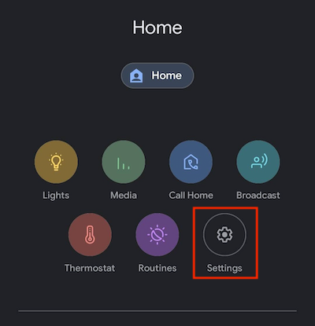
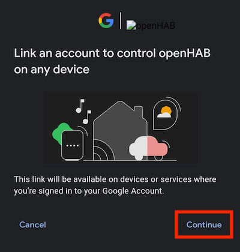
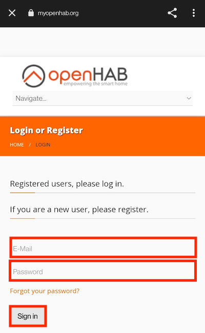
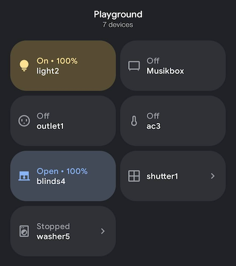

# Google Assistant Action

Google Assistant is Google’s virtual personal assistant and uses Actions on Google as the platform for "Actions" (software applications) to extend the functionality of the Google Assistant. Users engage Google Assistant in conversation to get things done, like controlling their devices and things at home. You can use the officially certified openHAB Action for Google Assistant to easily manage and control your smart home by conversational experiences between you and your openHAB smart home powered by voiced commands.

This guide describes step by step how to use the [openHAB Google Assistant Smart Home Action](https://assistant.google.com/services/a/uid/000000f5c61c627e?hl=en-US&source=web). The openHAB Action links your openHAB setup through the [myopenHAB.org](https://www.myopenhab.org) cloud service to the Google Assistant platform (for technical insights, please refer to this [guide](https://github.com/openhab/openhab-google-assistant/blob/master/README.md) to read more about setup options and development information).

With the Action you can voice control your openHAB items and it supports lights, plugs, switches, thermostats and many more. The openHAB Action comes with multiple language support like English, German or French language.

::: tip Note
Please be aware that the graphical user interface in the Google Home app or on Google Nest devices may not fully support interaction with some of the supported device types. We cannot influence this and rely on Google to implement user interfaces for more devices. Nevertheless, interaction via voice or in writing with Google Assistant should always work.
:::

If you have any issues, questions or an idea for additional features, please take a look at the [repository on GitHub](https://github.com/openhab/openhab-google-assistant).

[[toc]]

## Latest Changes

::: tip State of this document
This documentation refers to release [v3.6.5](https://github.com/openhab/openhab-google-assistant/releases/tag/v3.6.5) of [openHAB Google Assistant](https://github.com/openhab/openhab-google-assistant) published on 2023-07-17
:::

### v3.6.0

- Added new device types [`HumiditySensor`](#humiditysensor) & [`ClimateSensor`](#climatesensor)
- Changed trait of [`TemperatureSensor`](#temperaturesensor) to actually show a UI

### v3.5.0

- `ga="light"` for [`SpecialColorLight`](#light-as-group-with-separate-controls) is replaced by `ga="specialcolorlight"`
- `useKelvin=true` is replaced by `colorUnit="kelvin"`
- Support for color temperature in Mired added

## General Configuration

::: tip Note
This integration relies on the cloud connector addon.
More information can be found in the corresponding [docs page](https://www.openhab.org/link/openhabcloud).
:::

- The openHAB Cloud Connector configured using [myopenHAB.org](https://www.myopenhab.org) (Items do NOT need to be exposed to and will not show up on myopenHAB.org, this is only required for the IFTTT service!)
- A Google account
- A Google Home / Nest Voice Assistant Device or the Google Assistant on your phone

## Item Configuration

To expose [items](https://www.openhab.org/docs/concepts/items.html) to Google Assistent you will need to add [metadata](https://www.openhab.org/docs/concepts/items.html#item-metadata) in the `ga` namespace.

_Hint: The value of `ga` is **not** case-sensitive._

Currently the following devices are supported (also depending on Google's API capabilities):

### Switch

| | |
|---|---|
| **Device Type** | [Switch](https://developers.home.google.com/cloud-to-cloud/guides/switch) |
| **Supported Traits** | [OnOff](https://developers.home.google.com/cloud-to-cloud/traits/onoff) |
| **Supported Items** | Switch |
| **Configuration** | (optional) `inverted=true/false`<br>(optional) `checkState=true/false` |

**Example:**

```shell
Switch { ga="Switch" [ inverted=false ] }
```

### Light

| | |
|---|---|
| **Device Type** | [Light](https://developers.home.google.com/cloud-to-cloud/guides/light) |
| **Supported Traits** | [OnOff](https://developers.home.google.com/cloud-to-cloud/traits/onoff), [ColorSetting](https://developers.home.google.com/cloud-to-cloud/traits/colorsetting), [Brightness](https://developers.home.google.com/cloud-to-cloud/traits/brightness) (depending on used item type) |
| **Supported Items** | Switch, Dimmer, Color |
| **Configuration** | (optional) `inverted=true/false`<br>(optional) `checkState=true/false`<br>(optional) `colorTemperatureRange="minK,maxK"` |

```shell
Switch { ga="Light" [ inverted=true ] }
Dimmer { ga="Light" }
Color  { ga="Light" [ colorTemperatureRange="2000,9000" ] }
```

### Light as Group with separate controls

| | |
|---|---|
| **Device Type** | [Light](https://developers.home.google.com/cloud-to-cloud/guides/light) |
| **Supported Traits** | [OnOff](https://developers.home.google.com/cloud-to-cloud/traits/onoff), [ColorSetting](https://developers.home.google.com/cloud-to-cloud/traits/colorsetting), [Brightness](https://developers.home.google.com/cloud-to-cloud/traits/brightness) |
| **Supported Items** | Group as `SpecialColorLight` with the following members:<br>(optional) Number or Dimmer as `lightBrightness`<br>(optional) Number or Dimmer as `lightColorTemperature`<br>(optional) Color as `lightColor`<br>(optional) Switch as `lightPower` |
| **Configuration** | (optional) `colorUnit=percent/kelvin/mired`<br>(optional) `checkState=true/false`<br>(optional) `colorTemperatureRange="minK,maxK"`<br>_Hint: if you want to use `lightColorTemperature` you either need to set `colorUnit` to `kelvin` or `mired` or define a `colorTemperatureRange` as `colorUnit` defaults to `percent`_ |

```shell
Group  lightGroup { ga="SpecialColorLight" [ colorUnit="kelvin", colorTemperatureRange="2000,9000" ] }
Switch powerItem            (lightGroup) { ga="lightPower" }
Dimmer brightnessItem       (lightGroup) { ga="lightBrightness" }
Color  colorItem            (lightGroup) { ga="lightColor" }
Number colorTemperatureItem (lightGroup) { ga="lightColorTemperature" }
```

In case you want to control multiple lights using one device with Google Assistant, you can apply the following pattern:

```shell
Group        lightGroup { ga="SpecialColorLight" [ colorUnit="kelvin", colorTemperatureRange="2000,9000" ] }
Group:Switch powerItems      (lightGroup) { ga="lightPower" }
Group:Dimmer brightnessItems (lightGroup) { ga="lightBrightness" }
Group:Color  colorItems      (lightGroup) { ga="lightColor" }
...
Switch powerItem1            (powerItems)
Switch powerItem2            (powerItems)
...
Dimmer brightnessItem1       (brightnessItems)
Dimmer brightnessItem2       (brightnessItems)
...
Color colorItem1             (colorItems)
Color colorItem2             (colorItems)
...
```

### Scene

| | |
|---|---|
| **Device Type** | [Scene](https://developers.home.google.com/cloud-to-cloud/guides/scene) |
| **Supported Traits** | [Scene](https://developers.home.google.com/cloud-to-cloud/traits/scene) |
| **Supported Items** | Switch |
| **Configuration** | (optional) `sceneReversible=true/false`<br>(optional) `checkState=true/false` |

```shell
Switch { ga="Scene" [ sceneReversible=false ] }
```

### Outlet, Coffee_Maker, WaterHeater, Fireplace

| | |
|---|---|
| **Device Type** | [Outlet](https://developers.home.google.com/cloud-to-cloud/guides/outlet), [Coffee_Maker](https://developers.home.google.com/cloud-to-cloud/guides/coffeemaker), [WaterHeater](https://developers.home.google.com/cloud-to-cloud/guides/outlet), [Fireplace](https://developers.home.google.com/cloud-to-cloud/guides/fireplace) |
| **Supported Traits** | [OnOff](https://developers.home.google.com/cloud-to-cloud/traits/onoff) |
| **Supported Items** | Switch |
| **Configuration** | (optional) `inverted=true/false`<br>(optional) `checkState=true/false` |

```shell
Switch { ga="Outlet" [ inverted=true ] }
Switch { ga="Coffee_Maker" [ inverted=true ] }
Switch { ga="WaterHeater" [ inverted=false ] }
Switch { ga="Fireplace" }
```

### Valve

| | |
|---|---|
| **Device Type** | [Valve](https://developers.home.google.com/cloud-to-cloud/guides/valve) |
| **Supported Traits** | [OpenClose](https://developers.home.google.com/cloud-to-cloud/traits/openclose) |
| **Supported Items** | Switch |
| **Configuration** | (optional) `inverted=true/false`<br>(optional) `checkState=true/false` |

```shell
Switch { ga="Valve" [ inverted=true ] }
```

### Sprinkler, Vacuum

| | |
|---|---|
| **Device Type** | [Sprinkler](https://developers.home.google.com/cloud-to-cloud/guides/sprinkler), [Vacuum](https://developers.home.google.com/cloud-to-cloud/guides/vacuum) |
| **Supported Traits** | [StartStop](https://developers.home.google.com/cloud-to-cloud/traits/startstop) |
| **Supported Items** | Switch |
| **Configuration** | (optional) `inverted=true/false`<br>(optional) `checkState=true/false` |

```shell
Switch { ga="Sprinkler" [ inverted=true ] }
Switch { ga="Vacuum" [ inverted=false ] }
```

### Lock

| | |
|---|---|
| **Device Type** | [Lock](https://developers.home.google.com/cloud-to-cloud/guides/lock) |
| **Supported Traits** | [LockUnlock](https://developers.home.google.com/cloud-to-cloud/traits/lockunlock) |
| **Supported Items** | Contact (no device control), Switch |
| **Configuration** | (optional) `inverted=true/false`<br>(optional) `checkState=true/false`<br>(optional) `ackNeeded=true/false`<br>(optional) `pinNeeded="1234"` |

```shell
Switch { ga="Lock" [ ackNeeded=true ] }
Switch { ga="Lock" [ pinNeeded="1234" ] }
```

### SecuritySystem as Switch

| | |
|---|---|
| **Device Type** | [SecuritySystem](https://developers.home.google.com/cloud-to-cloud/guides/securitysystem) |
| **Supported Traits** | [ArmDisarm](https://developers.home.google.com/cloud-to-cloud/traits/armdisarm) |
| **Supported Items** | Switch |
| **Configuration** | (optional) `inverted=true/false`<br>(optional) `checkState=true/false`<br>(optional) `ackNeeded=true/false`<br>(optional) `pinNeeded="1234"`<br>(optional) `pinOnDisarmOnly=true/false`<br>(optional) `waitForStateChange=2` |

When used as a Switch, you will be limited to arming and disarming the system.

See `SecuritySystem as Group` for explanation on the configuration options.

Google Command: "_Hey Google, arm House Alarm_" OR "_Hey Google, disarm House Alarm_".

```shell
Switch houseAlarm "House Alarm" { ga="SecuritySystem", pinNeeded="1234" }
```

### SecuritySystem as Group with advanced functionality

| | |
|---|---|
| **Device Type** | [SecuritySystem](https://developers.home.google.com/cloud-to-cloud/guides/securitysystem) |
| **Supported Traits** | [ArmDisarm](https://developers.home.google.com/cloud-to-cloud/traits/armdisarm)<br>[StatusReport](https://developers.home.google.com/cloud-to-cloud/traits/statusreport) |
| **Supported Items** | Group as `SecuritySystem` with the following members: <br>Switch as `securitySystemArmed`<br>(optional) String as `securitySystemArmLevel`<br>(optional) Switch as `securitySystemTrouble`<br>(optional) String as `securitySystemTroubleCode`<br>(optional) Contact as `securitySystemZone` |
| **Configuration** | (optional) `inverted=true/false`<br>(optional) `checkState=true/false`<br>(optional) `ackNeeded=true/false`<br>(optional) `pinNeeded="1234"`<br> (optional) `pinOnDisarmOnly=true/false` <br>(optional) `waitForStateChange=2`<br>(optional) `armLevels="L1=Level 1,L2=Level 2"`<br><br>Specifically on Zone Contacts:<br>(required) `zoneType=OpenClose/Motion` <br>(optional) `blocking=true/false`|

Configuring the `SecuritySystem` as a Group will enable a lot of advanced functionality.

The `Switch` and the `Group` configuration support the following configuration parameters:

- `checkState=true` will compare the current state with the requested one and responds accordingly.
- `ackNeeded=true` will request an acknowledgement before performing an action.
- `pinNeeded="1234"` will request and check the configured PIN before performing an action.
- `pinOnDisarmOnly=true` will enforce the PIN on disarming only. Arming will be done without the PIN.
- `waitForStateChange=0` defines the number of seconds to wait for the security system state to update before checking that the arm/disarm was successful. Defaults to 0 if not specified.

When configured as a group, you can add arm levels as well as report errors and get details of zones causing the system to not arm.

`armLevels="Key=Label"` - The label is used for commanding Google Assistant, the key is the matching value sent to openHAB.

Google Command: "_Hey Google, set House Alarm to Level 1_" (L1 sent to item).

When using arm levels, Google will send the mapped level ID (L1,L2 in below example) to the item tagged with `securitySystemArmLevel` when you use the arm command. It will then use the status of the item `securitySystemArmed` to confirm that arming was successful.

When arming and not using arm levels or disarming, Google will send ON/OFF to the item tagged `securitySystemArmed`.

If arming fails and blocking zones have been configured with `securitySystemZone` and `blocking=true`, Google will attempt to check for zones that are causing the arming to fail.

`ga=securitySystemTrouble` and `ga=securitySystemTroubleCode` are used in a `StatusReport` to report any errors on the alarm, e.g. a flat battery.

```shell
Group   gHouseAlarm "House Alarm" { ga="SecuritySystem" [ pinNeeded="1234", armLevels="L1=Level 1,L2=Level 2" ] }
Switch  alarmArmed            (gHouseAlarm) { ga="securitySystemArmed" }
String  alarmArmLevel         (gHouseAlarm) { ga="securitySystemArmLevel" }
Switch  alarmTrouble          (gHouseAlarm) { ga="securitySystemTrouble" }
String  alarmTroubleErrorCode (gHouseAlarm) { ga="securitySystemTroubleCode" }
Contact frontDoorSensor       (gHouseAlarm) { ga="securitySystemZone" [ zoneType="OpenClose", blocking="true" ] }
```

### Camera

| | |
|---|---|
| **Device Type** | [Camera](https://developers.home.google.com/cloud-to-cloud/guides/camera) |
| **Supported Traits** | [CameraStream](https://developers.home.google.com/cloud-to-cloud/traits/camerastream) |
| **Supported Items** | String |
| **Configuration** | (optional) `protocols="hls,dash,smooth_stream,progressive_mp4"` _(choose suitable)_ |

```shell
String { ga="Camera" [ protocols="hls,dash" ] }
```

### Speaker (volume control only)

| | |
|---|---|
| **Device Type** | [Speaker](https://developers.home.google.com/cloud-to-cloud/guides/speaker) |
| **Supported Traits** | [Volume](https://developers.home.google.com/cloud-to-cloud/traits/volume) |
| **Supported Items** | Dimmer |
| **Configuration** | (optional) `checkState=true/false`<br>(optional) `volumeDefaultPercentage="20"`<br>(optional) `levelStepSize="5"`<br>(optional) `volumeMaxLevel="100"` |

```shell
Dimmer { ga="Speaker" [ volumeDefaultPercentage="50", levelStepSize="10", volumeMaxLevel="90" ] }
```

### TV

| | |
|---|---|
| **Device Type** | [TV](https://developers.home.google.com/cloud-to-cloud/guides/tv) |
| **Supported Traits** | [OnOff](https://developers.home.google.com/cloud-to-cloud/traits/onoff), [Volume](https://developers.home.google.com/cloud-to-cloud/traits/volume), [TransportControl](https://developers.home.google.com/cloud-to-cloud/traits/transportcontrol), [InputSelector](https://developers.home.google.com/cloud-to-cloud/traits/inputselector), [AppSelector](https://developers.home.google.com/cloud-to-cloud/traits/appselector), [Channel](https://developers.home.google.com/cloud-to-cloud/traits/channel) (depending on used members) |
| **Supported Items** | Group as `TV` with the following members:<br>(optional) Switch as `tvPower`<br>(optional) Switch as `tvMute`<br>(optional) Dimmer as `tvVolume`<br>(optional) String as `tvChannel`<br>(optional) String as `tvInput`<br>(optional) String as `tvApplication`<br>(optional) Player as `tvTransport` |
| **Configuration** | (optional) `checkState=true/false`<br>(optional) `volumeDefaultPercentage="20"`<br>(optional) `levelStepSize="5"`<br>(optional) `volumeMaxLevel="100"`<br>(optional) `transportControlSupportedCommands="NEXT,PREVIOUS,PAUSE,RESUME"`<br>(optional) `availableChannels="channelNumber=channelId=channelName:channelSynonym:...,..."`<br>(optional) `availableInputs="inputKey=inputName:inputSynonym:...,..."`<br>(optional) `availableApplications="applicationKey=applicationName:applicationSynonym:...,..."`<br>(optional) `lang="en"` |

```shell
Group  tvGroup { ga="TV" [ volumeDefaultPercentage="20", levelStepSize="10", volumeMaxLevel="100", transportControlSupportedCommands="NEXT,PREVIOUS,PAUSE,RESUME", availableChannels="1=Channel1=NBC,2=Channel2=CBS", availableInputs="hdmi1=xbox:gaming,hdmi2=settopbox", availableApplications="spotify=Spotify:Music,netflix=Netflix:Chill" ] }
Switch powerItem       (tvGroup) { ga="tvPower" }
Switch muteItem        (tvGroup) { ga="tvMute" }
Dimmer volumeItem      (tvGroup) { ga="tvVolume" }
String channelItem     (tvGroup) { ga="tvChannel" }
String inputItem       (tvGroup) { ga="tvInput" }
String applicationItem (tvGroup) { ga="tvApplication" }
Player transportItem   (tvGroup) { ga="tvTransport" }
```

### Fan, Hood, AirPurifier

| | |
|---|---|
| **Device Type** | [Fan](https://developers.home.google.com/cloud-to-cloud/guides/fan), [Hood](https://developers.home.google.com/cloud-to-cloud/guides/hood), [AirPurifier](https://developers.home.google.com/cloud-to-cloud/guides/airpurifier) |
| **Supported Traits** | [OnOff](https://developers.home.google.com/cloud-to-cloud/traits/OnOff), [FanSpeed](https://developers.home.google.com/cloud-to-cloud/traits/fanspeed) (depending on used item type) |
| **Supported Items** | Switch (no speed control), Dimmer |
| **Configuration** | (optional) `checkState=true/false`<br>(optional) `speeds="0=away:zero,50=default:standard:one,100=high:two"`<br>(optional) `lang="en"`<br>(optional) `ordered=true/false` |

Fans (and similar device types, like AirPurifier or Hood) support the `FanSpeed` trait.
If you do not specify the `speeds` option, Google will use and expect percentage values for the fan speed.
Otherwise, you will be able to set up and use human speakable modes, e.g. "fast" for 100% or "slow" for 25%.

`speeds` will be a comma-separated list of modes, where the mode value corresponds to the speed value to be passed to the device. The mode or value is followed by an equal sign to list different aliases separated by a colon sign.
So in the example stated below both "high" and "two" would set the speed to 100%.
Some devices may expect a specific value instead of a percentage, like "1" or "2" as speed values. In this case, you can adjust the configuration and replace the percentage values with the values that the device expects. (e.g.: `speeds="0=away:zero,1=default:standard:one,2=high:two"`).
You are also able to define the language of those aliases.
The option `ordered` will tell the system that your list is ordered and you will then be able to also say "faster" or "slower" and Google will use the next or previous speed.

```shell
Dimmer { ga="Fan" [ speeds="0=away:zero,50=default:standard:one,100=high:two", lang="en", ordered=true ] } # Only percentage values for the speed
Switch { ga="Hood" } # No speed control - only on/off
Dimmer { ga="AirPurifier" } # Only percentage values for the speed
Dimmer { ga="AirPurifier" [ speeds="0=away:zero,1=low:one,2=medium:two,3=high:three,4=turbo:four", lang="en", ordered=true ] } # Specific speed modes/values stated, which can differ from percentage
Switch { ga="AirPurifier" } # No speed control - only on/off
```

### Awning, Blinds, Curtain, Door, Garage, Gate, Pergola, Shutter, Window

| | |
|---|---|
| **Device Type** | [Awning](https://developers.home.google.com/cloud-to-cloud/guides/awning), [Blinds](https://developers.home.google.com/cloud-to-cloud/guides/blinds), [Curtain](https://developers.home.google.com/cloud-to-cloud/guides/curtain), [Door](https://developers.home.google.com/cloud-to-cloud/guides/door), [Garage](https://developers.home.google.com/cloud-to-cloud/guides/garage), [Gate](https://developers.home.google.com/cloud-to-cloud/guides/gate), [Pergola](https://developers.home.google.com/cloud-to-cloud/guides/pergola), [Shutter](https://developers.home.google.com/cloud-to-cloud/guides/shutter), [Window](https://developers.home.google.com/cloud-to-cloud/guides/window) |
| **Supported Traits** | [OpenClose](https://developers.home.google.com/cloud-to-cloud/traits/openclose), [StartStop](https://developers.home.google.com/cloud-to-cloud/traits/startstop) |
| **Supported Items** | Contact (no device control), Switch (no open percentage), Rollershutter |
| **Configuration** | (optional) `discreteOnly=true/false`<br>(optional) `queryOnly=true/false`<br>(optional) `inverted=true/false`<br>(optional) `checkState=true/false` |

Blinds and similar devices should always use the `Rollershutter` item type for proper functionality.
Since Google and openHAB use the opposite percentage value for "opened" and "closed", the action will translate this automatically.
If the values are still inverted in your case, you can state the `inverted=true` option for all `Rollershutter` items.

Since Google only tells the open percentage (and not the verb "close" or "down"), it can not be differentiated between saying "set blind to 100%" or "open blind".
Therefore, it is not possible to "not invert" the verbs, if the user chooses to invert the numbers.

```shell
Rollershutter { ga="Awning" }
Rollershutter { ga="Blinds" [ inverted=true ] }
Rollershutter { ga="Curtain" }
Switch        { ga="Door" }
Rollershutter { ga="Garage" }
Contact       { ga="Gate" }
Rollershutter { ga="Pergola" }
Rollershutter { ga="Shutter" }
Rollershutter { ga="Window" }
```

### Charger

| | |
|---|---|
| **Device Type** | [Charger](https://developers.home.google.com/cloud-to-cloud/guides/charger) |
| **Supported Traits** | [EnergyStorage](https://developers.home.google.com/cloud-to-cloud/traits/energystorage) |
| **Supported Items** | Group as `Charger` with the following members:<br>(optional) Switch as `chargerCharging`<br>(optional) Switch as `chargerPluggedIn`<br>(optional) Number or Dimmer as `chargerCapacityRemaining`<br>(optional) Number or Dimmer as `chargerCapacityUntilFull` |
| **Configuration** | (optional) `checkState=true/false`<br>(optional) `isRechargeable=true/false`<br>(optional) `unit="PERCENTAGE"` |

The configuration option `unit` supports the following values: `PERCENTAGE` (default), `SECONDS`, `MILES`, `KILOMETERS`, `KILOWATT_HOURS`

The setting `isRechargeable` defaults to `false` if not explicitly set to `true`.

If no `chargerCharging` item is specified, the device will only support queries.

```shell
Group  chargerGroup { ga="Charger" [ isRechargeable=true, unit="KILOWATT_HOURS" ] }
Switch chargingItem         (chargerGroup) { ga="chargerCharging" }
Switch pluggedInItem        (chargerGroup) { ga="chargerPluggedIn" }
Number capacityRemainItem   (chargerGroup) { ga="chargerCapacityRemaining" }
Number capacityFullItem     (chargerGroup) { ga="chargerCapacityUntilFull" }
```

### TemperatureSensor

| | |
|---|---|
| **Device Type** | [Sensor](https://developers.home.google.com/cloud-to-cloud/guides/sensor) |
| **Supported Traits** | [TemperatureControl](https://developers.home.google.com/cloud-to-cloud/traits/temperaturecontrol), [TemperatureSetting](https://developers.home.google.com/cloud-to-cloud/traits/temperaturesetting) |
| **Supported Items** | Number |
| **Configuration** | (optional) `useFahrenheit=true/false` |

```shell
Number { ga="TemperatureSensor" [ useFahrenheit=true ] }
```

### HumiditySensor

| | |
|---|---|
| **Device Type** | [Sensor](https://developers.home.google.com/cloud-to-cloud/guides/sensor) |
| **Supported Traits** | [HumiditySetting](https://developers.home.google.com/cloud-to-cloud/traits/humiditysetting) |
| **Supported Items** | Number |

```shell
Number { ga="HumiditySensor" }
```

### ClimateSensor

| | |
|---|---|
| **Device Type** | [Sensor](https://developers.home.google.com/cloud-to-cloud/guides/sensor) |
| **Supported Traits** | [HumiditySetting](https://developers.home.google.com/cloud-to-cloud/traits/humiditysetting), [TemperatureControl](https://developers.home.google.com/cloud-to-cloud/traits/temperaturecontrol), [TemperatureSetting](https://developers.home.google.com/cloud-to-cloud/traits/temperaturesetting) |
| **Supported Items** | Group as `ClimateSensor` with the following members:<br>(optional) Number as `humidityAmbient`<br>(optional) Number as `temperatureAmbient` |
| **Configuration** | (optional) `useFahrenheit=true/false` |

```shell
Group  sensorGroup { ga="ClimateSensor" [ useFahrenheit=true ] }
Number temperatureItem (sensorGroup) { ga="temperatureAmbient" }
Number humidityItem    (sensorGroup) { ga="humidityAmbient" }
```

### Thermostat

| | |
|---|---|
| **Device Type** | [Thermostat](https://developers.home.google.com/cloud-to-cloud/guides/thermostat) |
| **Supported Traits** | [TemperatureSetting](https://developers.home.google.com/cloud-to-cloud/traits/temperaturesetting) |
| **Supported Items** | Group as `Thermostat` with the following members:<br>String or Number as `thermostatMode`<br>(optional) Number as `thermostatHumidityAmbient`<br>(optional) Number as `thermostatTemperatureAmbient`<br>(optional) Number as `thermostatTemperatureSetpoint`<br>(optional) Number as `thermostatTemperatureSetpointLow`<br>(optional) Number as `thermostatTemperatureSetpointHigh` |
| **Configuration** | (optional) `checkState=true/false`<br>(optional) `useFahrenheit=true/false`<br>(optional) `thermostatTemperatureRange="10,30"`<br>(optional) `modes="off=OFF:WINDOW_OPEN,heat=COMFORT:BOOST,eco=ECO,on=ON,auto"` |

Thermostat requires a group of items to be properly configured to be used with Google Assistant. The default temperature unit is Celsius.
To change the temperature unit to Fahrenheit, add the config option `useFahrenheit=true` to the thermostat group.
To set the temperature range your thermostat supports, add the config option `thermostatTemperatureRange="10,30"` to the thermostat group. Those values always have to be provided in Celsius!
If your thermostat supports a range for the setpoint you can use both `thermostatTemperatureSetpointLow` and `thermostatTemperatureSetpointHigh` instead of the single `thermostatTemperatureSetpoint` item.

If your thermostat does not have a mode, you should create one and manually assign a value (e.g. heat, cool, on, etc.) to have proper functionality.

To map the [default thermostat modes of Google](https://developers.home.google.com/cloud-to-cloud/traits/temperaturesetting.html) (on, off, heat, cool, etc.) to custom ones for your specific setup, you can use the `modes` config option on the thermostat group.
E.g. `[ modes="off=OFF:WINDOW_OPEN,heat=COMFORT:BOOST,eco=ECO,on=ON,auto" ]` will enable the following five modes in Google Home `"off, heat, eco, on, auto"` that will be translated to `"OFF, COMFORT, ECO, ON, auto"`. You can specify alternative conversions using the colon sign, so that in the former example "BOOST" in openHAB would also be translated to "heat" in Google. For the translation of Google modes to openHAB always the first option after the equal sign is used.
By default the integration will provide `"off,heat,cool,on,heatcool,auto,eco"`.

You can also set up a Thermostat for using it as a temperature sensor. To do so, create a Thermostat group and only add one item member as "thermostatTemperatureAmbient".
However, it is recommended to prefer the `TemperatureSensor` type for simple temperature reports (but currently there is no UI support in Google Home).

```shell
Group  thermostatGroup { ga="Thermostat" [ modes="off=OFF:WINDOW_OPEN,heat=COMFORT:BOOST,eco=ECO,on=ON,auto", thermostatTemperatureRange="10,30", useFahrenheit=false ] }
Number temperatureItem  (thermostatGroup) { ga="thermostatTemperatureAmbient" }
Number humidityItem     (thermostatGroup) { ga="thermostatHumidityAmbient" }
Number setpointItem     (thermostatGroup) { ga="thermostatTemperatureSetpoint" }
Number setpointItemLow  (thermostatGroup) { ga="thermostatTemperatureSetpointLow" }
Number setpointItemHigh (thermostatGroup) { ga="thermostatTemperatureSetpointHigh" }
String modeItem         (thermostatGroup) { ga="thermostatMode" }
```

### Sensor

| | |
|---|---|
| **Device Type** | [Sensor](https://developers.home.google.com/cloud-to-cloud/guides/sensor) |
| **Supported Traits** | [SensorState](https://developers.home.google.com/cloud-to-cloud/traits/sensorstate) |
| **Supported Items** | Number, Dimmer |
| **Configuration** |`sensorName="SmokeLevel"`<br>`valueUnit="PARTS_PER_MILLION"`<br>`states="no smoke=10,smoke detected=50,high=90"` |

Please see the [SensorState documentation](https://developers.home.google.com/cloud-to-cloud/traits/sensorstate) for more details on configuration options.
For now only exact matches of the numeric value will report the descriptive state value.

```shell
Number { ga="Sensor" [ sensorName="AirQuality", valueUnit="AQI", states="good=10,moderate=50,poor=90" ] }
```

## Additional Configuration

Item labels are not mandatory in openHAB, but for the Google Assistant Action they are absolutely necessary!

It is the "label text" (e.g. "Kitchen Lights" for example above) and not the item's name that will be available to you via voice commands or in the Google Home app, so make it unique and easy to say!

If you do not want to adjust your labels to be human spellable, you can use the "name" config option in the metadata: `[ name="Kitchen Lights" ]`. This will overwrite the label as the device's name.

Furthermore, you can state synonyms for the device name: `Switch KitchenLight "Kitchen Lights" { synonyms="Top Light", ga="Light" }`.

To ease setting up new devices you can add a room hint: `[ roomHint="Living Room" ]`.

For devices supporting the OpenClose trait, the attributes `[ discreteOnly=false, queryOnly=false ]` can be configured.

- `discreteOnly` defaults to false. When set to true, this indicates that the device must either be fully open or fully closed (that is, it does not support values between 0% and 100%). An example of such a device may be a valve.
- `queryOnly` defaults to false. Is set to true for `Contact` items. Indicates if the device can only be queried for state information and cannot be controlled. Sensors that can only report open state should set this field to true.

All device types support checking the current state before sending an updated state by a command. This can be enabled by setting `[ checkState=true ]` in the metadata. When this is enabled, the current state of the target item is queried and compared to the potential new state triggered by the command. If it is identical, a special error message is triggered and communicated to the user.

---

NOTE: metadata is not available via paperUI in openHAB v2. Either you create your items via ".items" files, or you can:

- add metadata via console:

  ```shell
  smarthome:metadata add BedroomLights ga Light
  ```

- add metadata using the REST API:

  ```js
  PUT /rest/items/BedroomLights/metadata/ga

  {
    "value": "Light"
  }
  ```

### Two-Factor-Authentication

For some actions, Google recommends to use TFA (Two-Factor-Authentication) to prevent accidental or unauthorized triggers of sensitive actions. See [Two-factor authentication &nbsp;|&nbsp; Actions on Google Smart Home](https://developers.google.com/assistant/smarthome/develop/two-factor-authentication).

The openHAB Google Assistant integration supports both _ackNeeded_ and _pinNeeded_. You can use both types on all devices types and traits.

_ackNeeded_: "A two-factor authentication that requires explicit acknowledgement (yes or no) and can also use trait states as response feedback. This challenge type is not recommended for security devices and traits."

_pinNeeded_: "A two-factor authentication that requires a personal identification number (PIN), which is ideal for security devices and traits."

Example:

```shell
Switch DoorLock   "Front Door"  { ga="Lock" [ ackNeeded=true ] }
Switch HouseAlarm "House Alarm" { ga="SecuritySystem" [ pinNeeded="1234" ] }
```

## Setup & Usage of the Google Home App

- Make sure Google Play Services is up to date.
- Visit "Google Home" app entry in Google Play Store on Android.
- Set up the voice-activated speaker or Android phone (version 6+) with your Google account.
- Make sure you're the correct user.
- Start the Google Home app on your phone.
- Go to the settings part: `Home > Settings`.



- Press the `+ Add device` button in the Settings screen.


- Choose `Works with Google`


- Search and select `openHAB`.


- Continue with linking your account.



- Login at `myopenhab.org` with your username and password.



- Make sure to assign your devices to rooms to properly use voice commands.
- You can now control your devices from the Google Assistant and Google Home.



## Example Voice Commands

Here are some example voice commands:

- Turn on Office Lights.
- Dim/Brighten Office Lights (increments 15%).
- Set Office Lights to 35%.
- Open/Close the blinds
- Turn off Pool Waterfall.
- Turn on House Fan.
- Turn on Home Theater Scene.
- Set Basement Thermostat to 15 degrees.
- What is the current Basement Thermostat Temperature?

## Frequently Asked Question

My New items did not appear in the Google Home app.

- Say: `Hey Google, sync my devices`

I'm not able to connect openHAB to Google Home.

- Check, recheck and after that check again your items!
- The items that you want to expose to Google Assistant should have the right metadata assigned.
- The items that you want to expose to Google Assistant must have a item label! [Item Definition and Syntax](https://www.openhab.org/docs/configuration/items.html#item-definition-and-syntax)
- If none of the above solutions works for you:
  - Remove all the metadata.
  - Make a new .item file with 1 item to expose.

  ```shell
  Switch TestSwitch "Test Switch" { ga="Switch" }
  ```

  - Relink your account.
